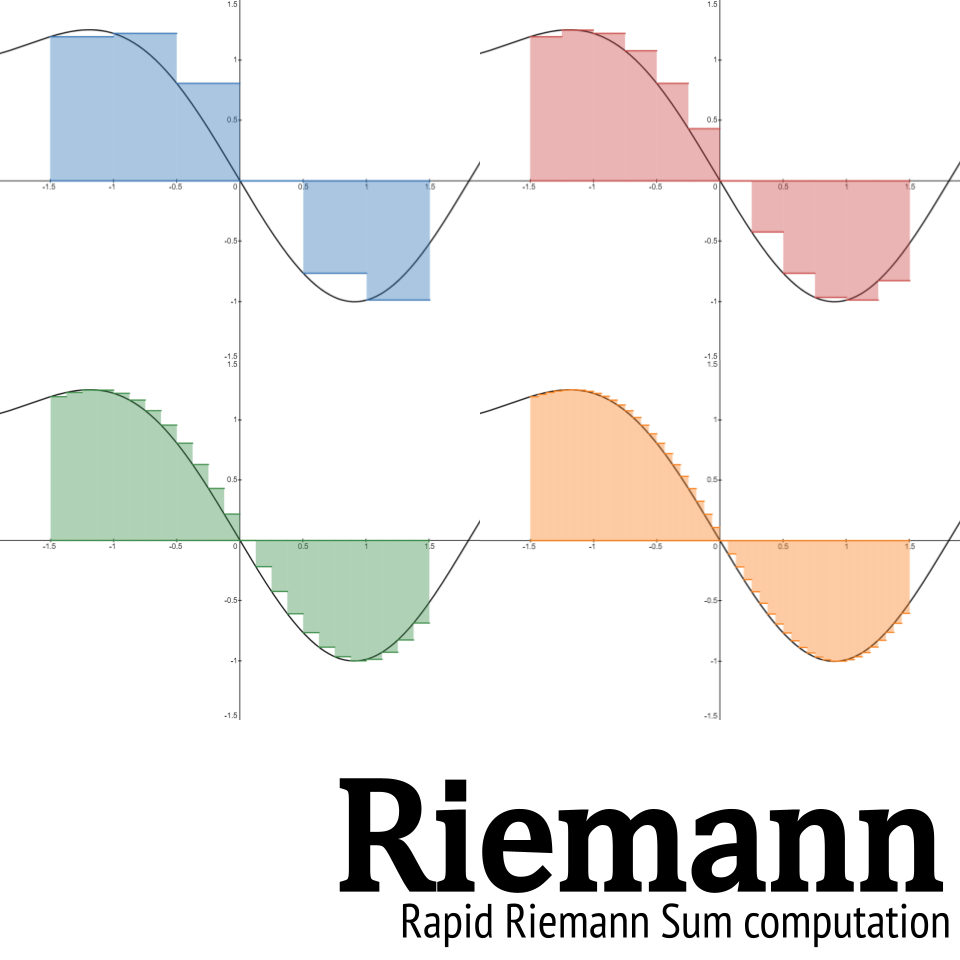

# riemann



**Riemann**, a pure-Python package for computing Riemann sums of functions of several real variables.

[](https://github.com/JacobLee23/riemann/blob/master/LICENSE)

[](https://pypi.org/project/riemann)
[](https://github.com/JacobLee23/riemann/tags)

***

## Basic Usage

**Riemann** provides an intuitive syntax for calculating the Riemann sum of a function over a closed interval. The below code snippet computes the Riemann sum of $f(x) = x^{2}$ over the interval $[0, 1]$ using 10 partitions along the $x$ axis.

```python
>>> import riemann
>>> from riemann import Interval
>>> f = lambda x: x ** 2
>>> intervals = [Interval(0, 1, 10)]
>>> methods = [riemann.LEFT]
>>> riemann.rsum(f, intervals, methods)
Decimal('0.285')
```

However, **Riemann** is not restricted to computing Riemann sums only over one dimension. A similar syntax can be used to calculate the Riemann sum of a function of several real variables over a closed multi-dimensional interval. The below code snippet computes the Riemann sum of $f(x, y) = x^{2} + y^{2}$ over the interval $x \in [0, 1], y \in [0, 1]$ using 10 partitions along the $x$ axis and 10 partitions along the $y$ axis.

```python
>>> import riemann
>>> from riemann import Interval
>>> f = lambda x, y: x ** 2 + y ** 2
>>> intervals = [Interval(0, 1, 10), Interval(0, 1, 10)]
>>> methods = [riemann.LEFT, riemann.LEFT]
>>> riemann.rsum(f, intervals, methods)
Decimal('0.57')
```

## Features

- Fast computation of Riemann sum.
- Support for computation of multi-dimensional Riemann sum.
- Built-in support for left, middle, and right Riemann sum methods.

## Requirements

**Riemann** requires Python 3.7+. This project does not require any additional dependencies.

## Installation

```console
$ pip install riemann
```

## Documentation

[](https://riemann-py.readthedocs.io/en/latest/?badge=latest)

The documentation for this project is available on [Read the Docs](https://riemann-py.readthedocs.io/en/latest).
